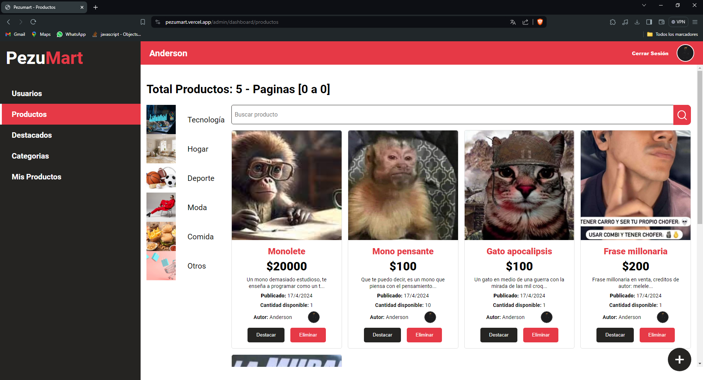
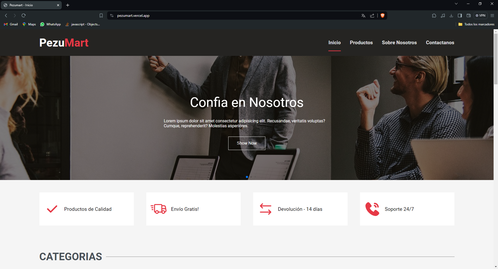
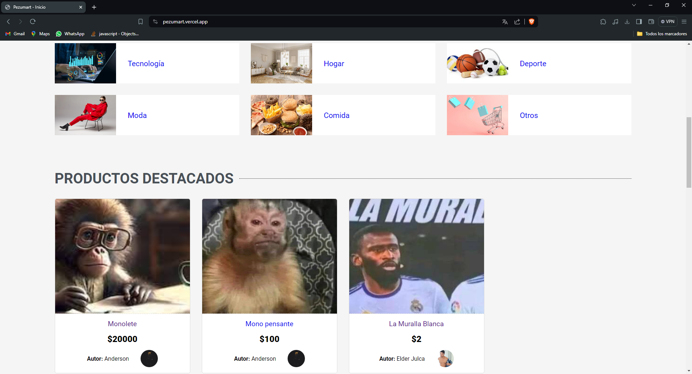
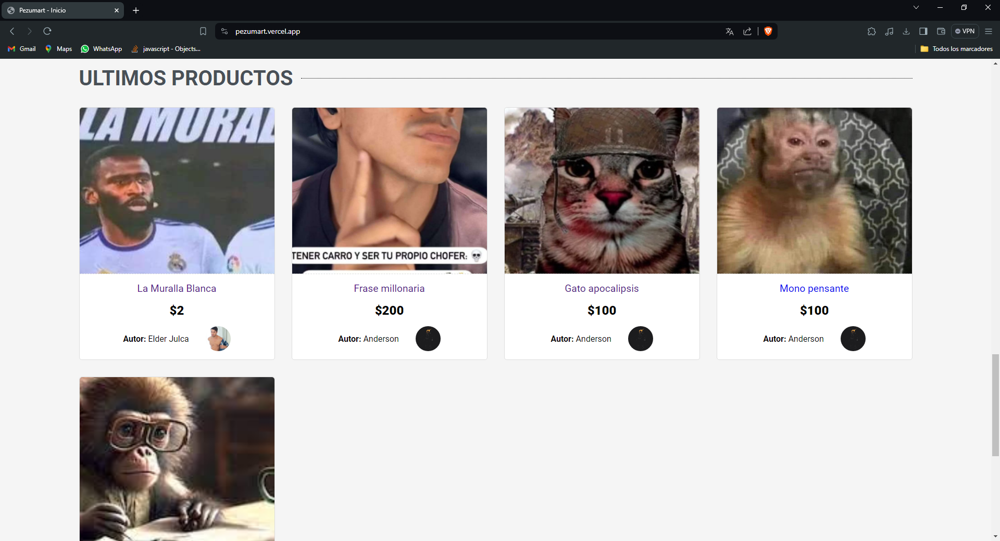
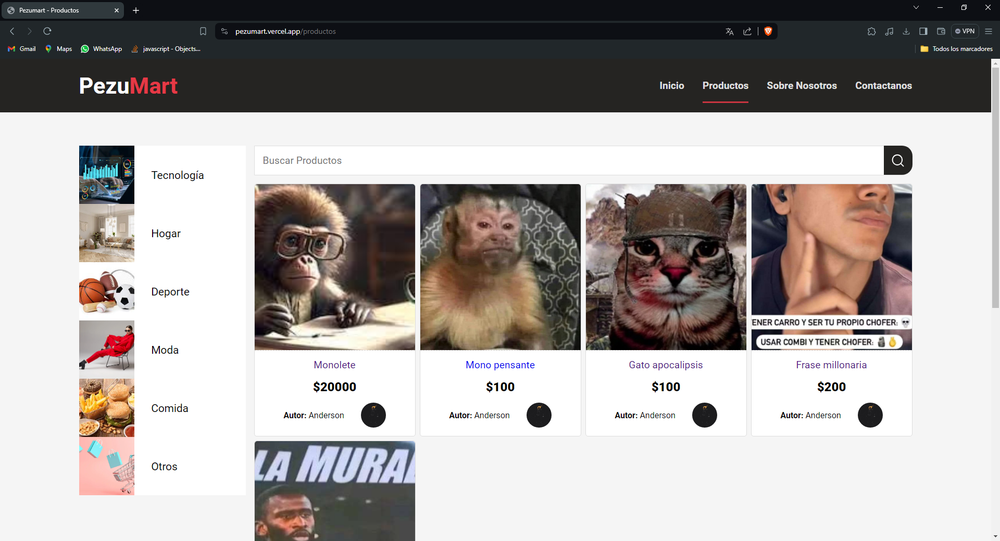
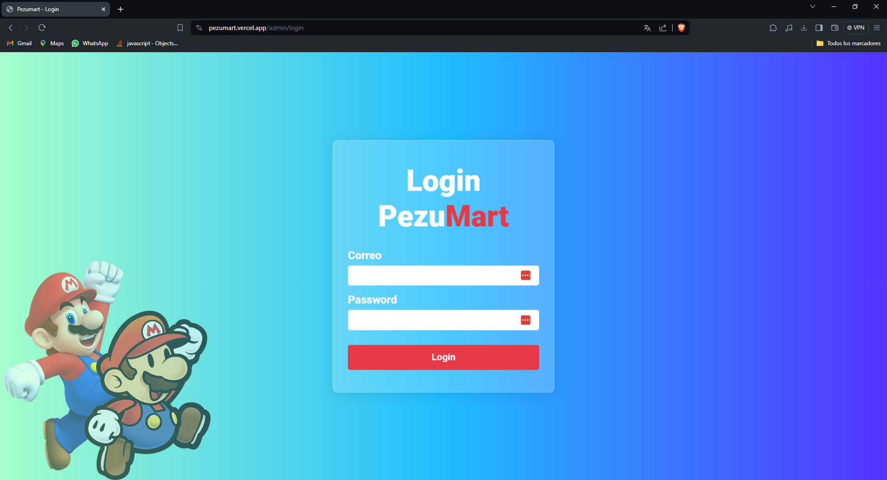
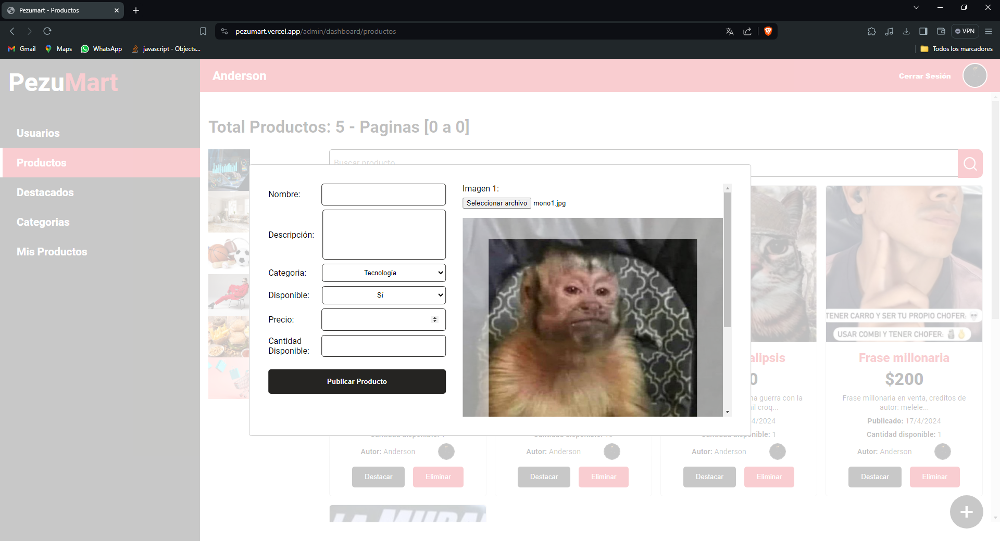
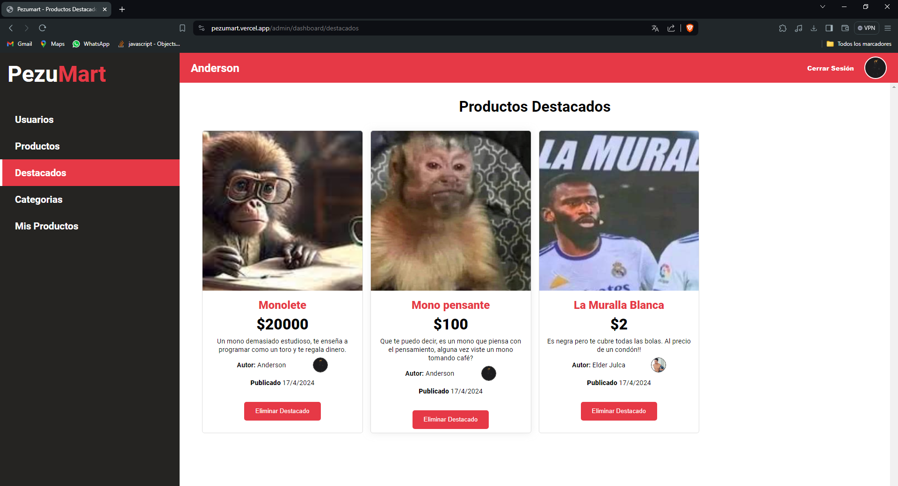
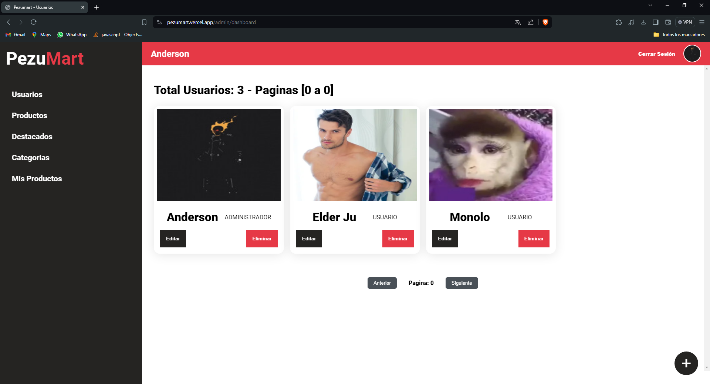
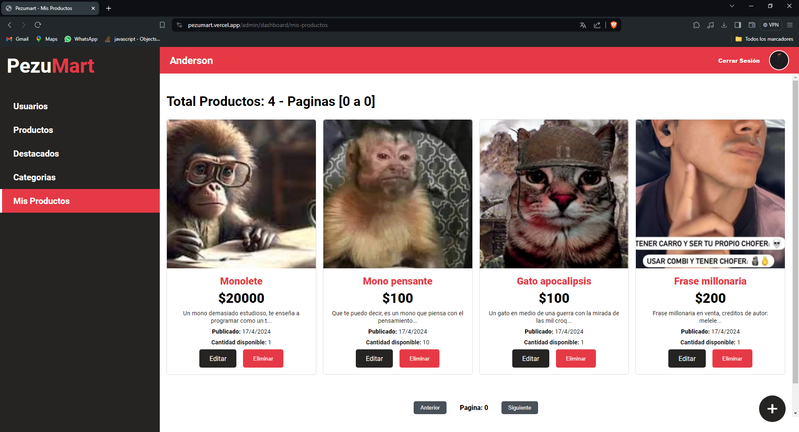

# Pezumart - Frontend


## Ver primero [backend](https://github.com/DAndersonBurga/Pezumart-backend)

## Configuración
Ejecutar:
```properties
npm install
```
Luego debes crear un archivo .env en la raíz del proyecto con la siguiente variable de entorno:
```javascript
VITE_BACKEND_URL="http://localhost:8080/api/v1"
```

## Levantar el proyecto
Primero debes ejecutar el [backend](https://github.com/DAndersonBurga/Pezumart-backend)
Luego ejecuta el siguiente comando:
```properties
npm run dev
```

## Paginas
### Index




### Productos


### Login


### Dashboard




